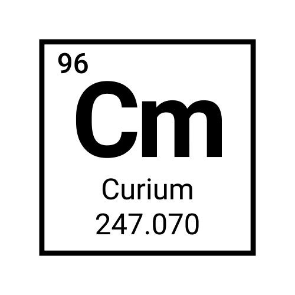

<p align="center">
  
</p>
<h1 align="center"><i>Curium</i> Rust Axum (with steroids)</h1>
<p align="center">
  <a href="#">
    
  </a>
  <a href="https://github.com/muhrifqii/curium-rust-axum/blob/master/LICENSE">
    
  </a>
</p>
<p align="center">
  <b>Curium (CM)</b> is a man-made metallic element heavier than anything 
  found naturally on Earth. Because it's radioactive, it's used very carefully 
  in research and in some special tools, like power sources for long space 
  missions. In this case, a long space mission on software engineering project.
</p>

---

A modern, extensible REST API built with Rust and Axum, following Hexagonal Architecture principles.

## Architecture

This project follows Hexagonal Architecture (also known as Ports and Adapters) to ensure:

- **Domain Logic Isolation**: Core business logic is independent of external concerns
- **Testability**: Easy to test business logic in isolation
- **Flexibility**: Easy to swap out implementations (e.g., different databases)
- **Maintainability**: Clear separation of concerns

### Project Structure

```
main/src/
├── domain/           # Core business logic and entities
├── infrastructure/   # External adapters (DB, HTTP, etc.)
├── router/          # HTTP routing and handlers
└── types/           # Common types and error handling
```

### Key Components

- **Domain Layer**: Contains business logic and entities
- **Ports**: Interfaces that define how the application interacts with the outside world
- **Adapters**: Implementations of ports (e.g., SQLite/PostgreSQL repositories)
- **Application Services**: Orchestrate the flow of data and business logic

## Features

- RESTful API with Axum
- Extensible database support:
  - SQLite (default)
  - PostgreSQL (optional)
- Structured logging
- CORS support
- Request tracing
- Error handling
- Configuration management

## Getting Started

### Prerequisites

- Rust (latest stable)
- SQLite (for default setup)
- PostgreSQL (optional)

### Installation

1. Clone the repository:
   ```bash
   git clone https://github.com/yourusername/curium-rust-axum.git
   cd curium-rust-axum
   ```

2. Build the project:
   ```bash
   cargo build
   ```

3. Run the application:
   ```bash
   cargo run
   ```

### Configuration

The application can be configured using environment variables or configuration files. See `configs/` directory for examples.

### Database Setup

#### SQLite (Default)
```bash
# The database will be created automatically at the configured path
```

#### PostgreSQL
```bash
# Enable PostgreSQL feature
cargo run --features db-pg
```

## API Endpoints

### Users

- `POST /users` - Create a new user
- `GET /users` - Get list of user
- `GET /users/{id}` - Get user by ID
- `PUT /users/{id}` - Update user
- `DELETE /users/{id}` - Delete user

## Development

### Running Tests

```bash
cargo test
```

### Code Style

This project uses rustfmt for code formatting. Run:

```bash
cargo fmt
```

## Contributing

1. Fork the repository
2. Create your feature branch (`git checkout -b feature/amazing-feature`)
3. Commit your changes (`git commit -m 'Add some amazing feature'`)
4. Push to the branch (`git push origin feature/amazing-feature`)
5. Open a Pull Request

## License

This project is licensed under the MIT License - see the LICENSE file for details.

---